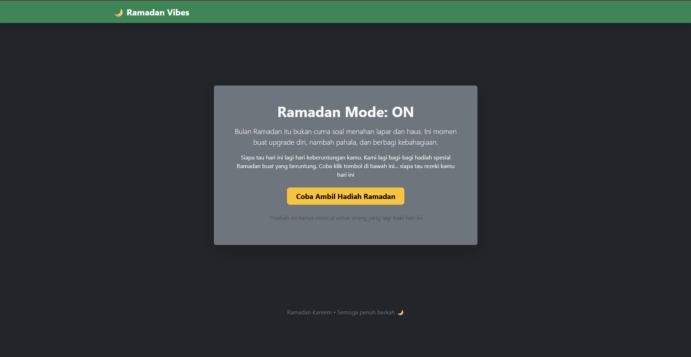
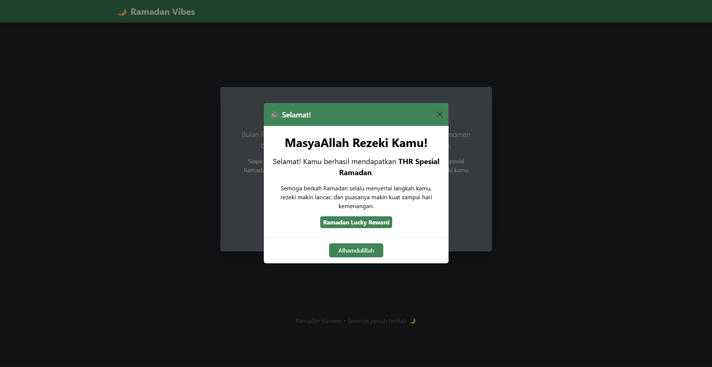

# 🌙 Ramadan Vibes Website

## Deskripsi Project

Website **Ramadan Vibes** merupakan halaman web sederhana yang dibuat menggunakan **Bootstrap 5**.
Halaman ini menampilkan tema Ramadan yang menarik dan interaktif.

Pengguna dapat menekan sebuah tombol untuk mencoba mendapatkan hadiah **THR Ramadan**, kemudian akan muncul **modal pop-up** yang menampilkan pesan bahwa pengguna mendapatkan THR.

# Fitur Website

Website ini memiliki beberapa fitur utama:

### 1 Navbar

Bagian header menggunakan **Bootstrap Navbar** dengan tema Ramadan.

### 2️ Card Informasi

Menampilkan informasi singkat tentang Ramadan dan ajakan untuk mencoba mendapatkan hadiah.

### 3️ Button Interaktif

Tombol yang dapat diklik untuk membuka modal hadiah.

### 4️ Modal Pop-up

Ketika tombol ditekan, akan muncul **modal Bootstrap** yang menampilkan pesan:

> Selamat! Anda mendapatkan THR Ramadan

---

# Teknologi yang Digunakan

Project ini dibuat menggunakan:

- **HTML5**
- **Bootstrap 5**
- **Bootstrap Modal Component**

Bootstrap digunakan melalui **CDN**, sehingga tidak perlu instalasi tambahan.

---

# 📂 Struktur Project

```
ramadan-vibes/
│
├── index.html
└── README.md
```

# Penjelasan Kode

## 1. Bootstrap CDN

Bootstrap diambil menggunakan CDN agar styling dapat langsung digunakan.

```html
<link
  href="https://cdn.jsdelivr.net/npm/bootstrap@5.3.2/dist/css/bootstrap.min.css"
  rel="stylesheet"
/>
```

Script Bootstrap juga ditambahkan agar fitur interaktif seperti **modal** dapat berjalan.

```html
<script src="https://cdn.jsdelivr.net/npm/bootstrap@5.3.2/dist/js/bootstrap.bundle.min.js"></script>
```

---

## 2. Navbar

Navbar digunakan sebagai header website.

```html
<nav class="navbar navbar-dark bg-success"></nav>
```

Class Bootstrap yang digunakan:

- `navbar`
- `navbar-dark`
- `bg-success`

---

## 3. Card

Card digunakan untuk menampilkan informasi Ramadan dan tombol hadiah.

```html
<div class="card bg-secondary text-light shadow-lg"></div>
```

Fungsi class:

- `card` → komponen Bootstrap
- `bg-secondary` → warna background
- `shadow-lg` → efek bayangan

---

## 4. Button

Button digunakan untuk memicu munculnya modal.

```html
<button data-bs-toggle="modal" data-bs-target="#thrModal"></button>
```

Penjelasan:

- `data-bs-toggle="modal"` → mengaktifkan modal
- `data-bs-target="#thrModal"` → menghubungkan tombol dengan modal

---

## 5. Modal

Modal digunakan untuk menampilkan pesan hadiah THR.

```html
<div class="modal fade" id="thrModal"></div>
```

Modal akan muncul ketika tombol ditekan dan menampilkan pesan ucapan selamat.

---

# Tampilan Website

## Halaman Utama





---

# Kesimpulan

Project **Ramadan Vibes Website** menunjukkan bagaimana membuat halaman web sederhana yang menarik menggunakan **Bootstrap** tanpa menggunakan CSS manual.

---
