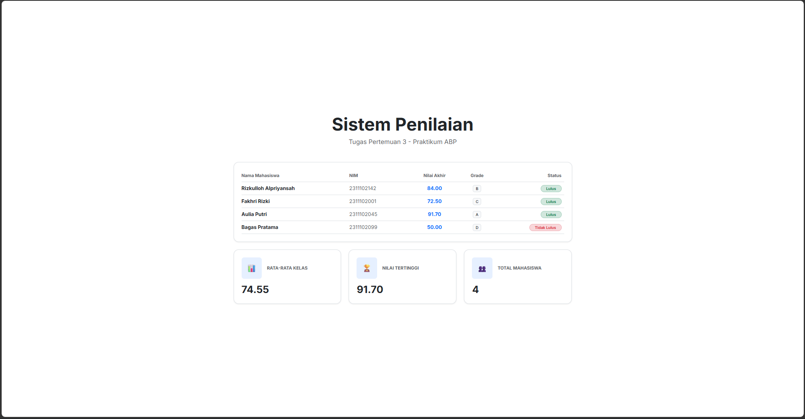

# Tugas Pertemuan 3 - PHP: Sistem Penilaian Mahasiswa

Tugas ini berisi program PHP sederhana untuk menampilkan data mahasiswa, menghitung nilai akhir, menentukan grade, dan status kelulusan menggunakan Bootstrap 5.

## Identitas Mahasiswa
- **Nama:** Rizkulloh Alpriyansah
- **NIM:** 2311102142
- **Kelas:** Praktikum ABP (IF-06)

## Hasil Screenshot


## Cara Menjalankan
1. Pastikan PHP sudah terinstal di komputer Anda.
2. Buka terminal atau command prompt pada direktori folder tugas ini.
3. Jalankan server lokal PHP dengan perintah:
   ```bash
   php -S localhost:8000
   ```
4. Buka browser dan akses alamat berikut:
   **[http://localhost:8000](http://localhost:8000)**

## Deskripsi Program
- **Array Asosiasi**: Digunakan untuk menyimpan data mahasiswa secara terstruktur.
- **Functions**: Implementasi logika perhitungan nilai akhir, penentuan grade, dan status kelulusan.
- **Statistik**: Perhitungan rata-rata kelas dan pencarian nilai tertinggi secara otomatis.
