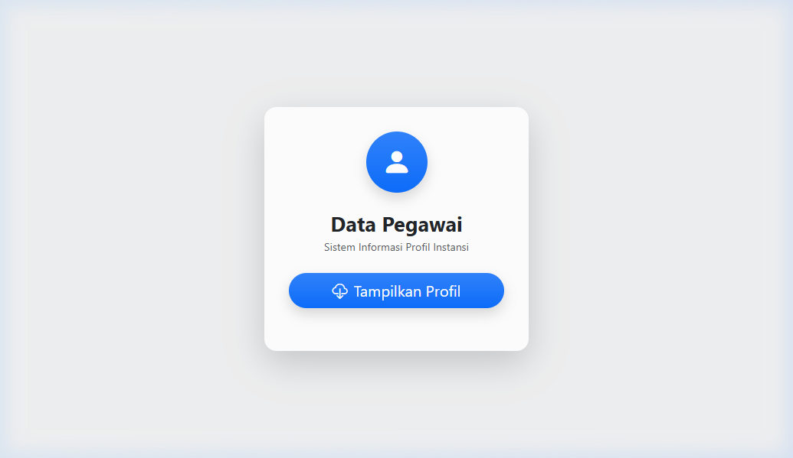
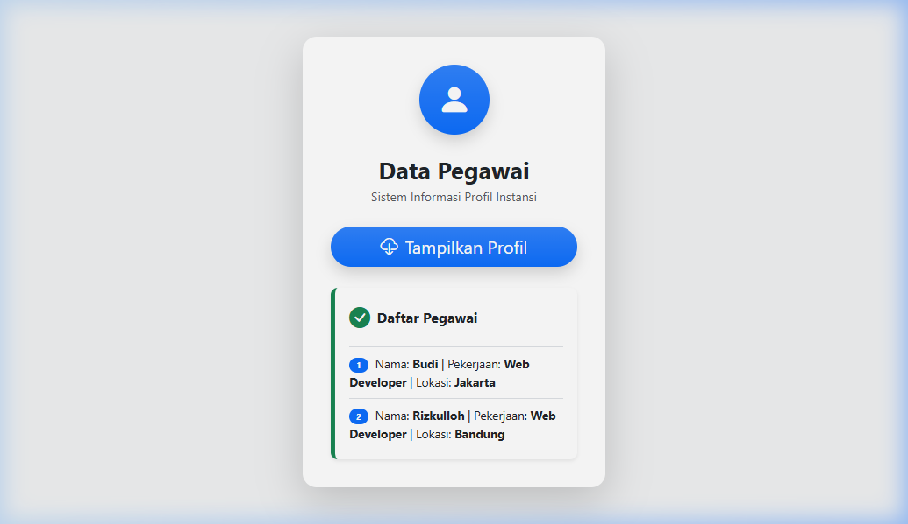

# Tugas Praktikum ABP - Modul Ajax

**Identitas Mahasiswa:**
- **Nama:** Rizkulloh Alpriyansah
- **NIM:** 2311102142

---

## Penjelasan Singkat
Tugas ini mengimplementasikan konsep Ajax (Asynchronous JavaScript and XML) menggunakan **Fetch API** untuk mengambil data dari server secara *background* tanpa harus memuat ulang (*reload*) seluruh halaman web.

1.  **Server side (`data.php`):** Berfungsi sebagai pemberi data (API). Data disimpan dalam bentuk array PHP yang kemudian diubah menjadi format **JSON** menggunakan `json_encode()`. Header `Content-Type: application/json` ditambahkan agar browser mengenali format datanya.
2.  **Client side (`index.html`):** Berfungsi sebagai antarmuka pengguna. Menggunakan **Bootstrap 5** untuk styling agar tampilan terlihat modern. Logika JavaScript menangani event klik pada tombol, melakukan *fetch* ke server, dan menampilkan hasilnya ke dalam elemen div secara dinamis.

---

## Dokumentasi (Screenshot)

### 1. Tampilan Awal
Berikut adalah tampilan awal halaman saat baru dimuat. Tombol "Tampilkan Profil" siap untuk diklik.

### 2. Tampilan Setelah Data Berhasil Diambil
Setelah tombol diklik, JavaScript melakukan request ke `data.php`, lalu data yang diterima ditampilkan dalam bentuk daftar pegawai dengan format yang rapi.

