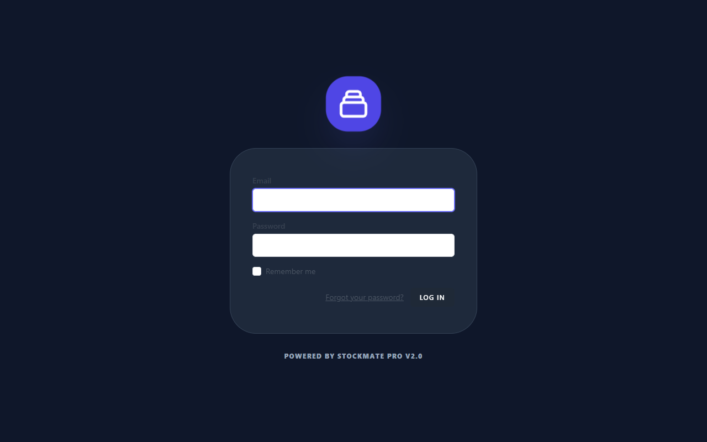
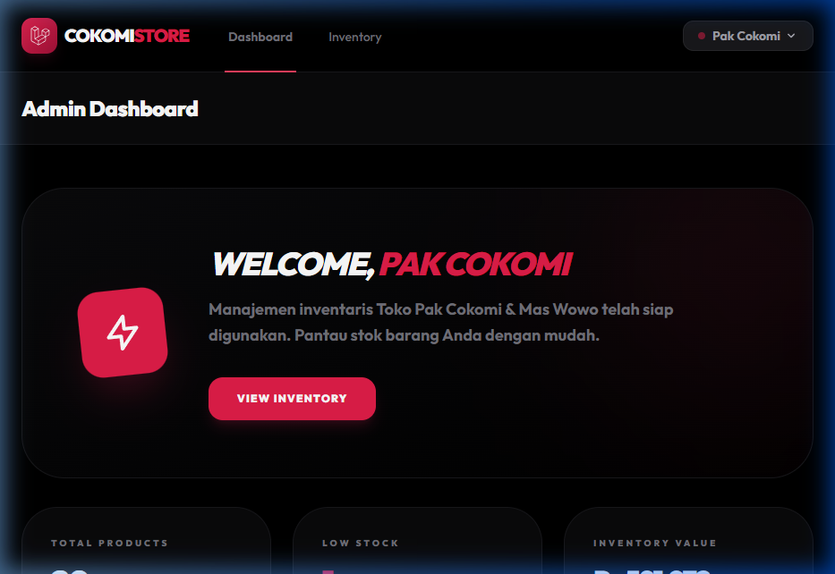
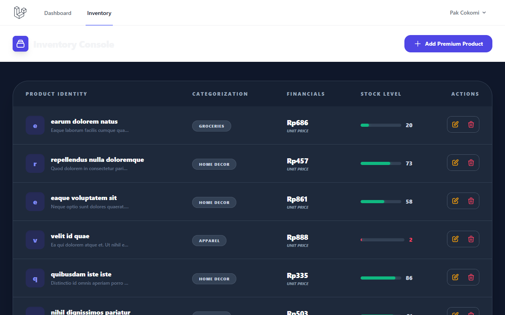
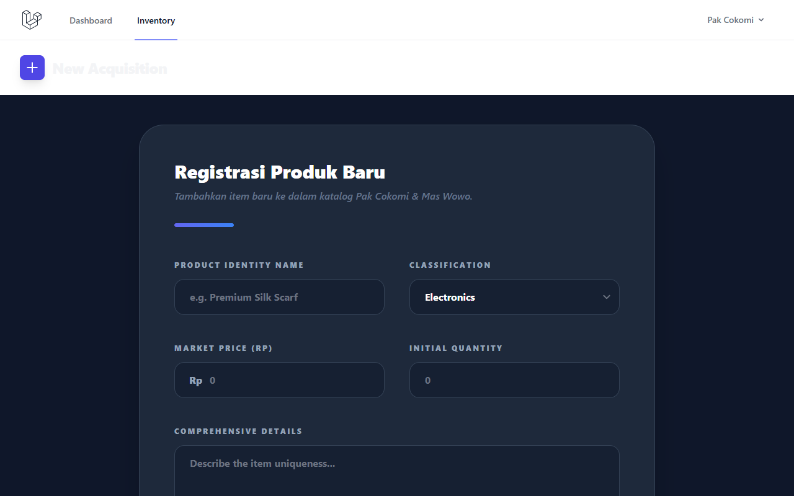
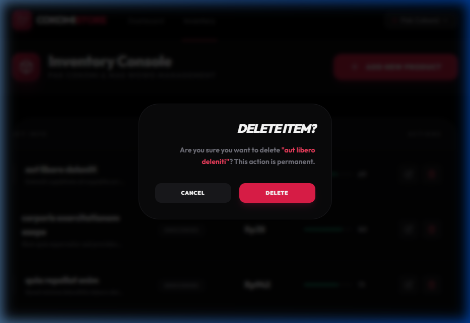

# 🏪 Inventory Management System - Pak Cokomi & Mas Wowo

Tugas Praktikum ABP Pertemuan 5. Sistem Informasi Inventaris Toko menggunakan Laravel, Breeze, dan SQLite. Proyek ini mengusung tema **Dark Mode (Black & Red)** yang premium dan modern.

## ✨ Fitur Utama
- **Authentication**: Sistem login aman menggunakan Laravel Breeze.
- **Dashboard**: Statistik real-time (Total Produk, Valuasi Inventaris, Low Stock Alert).
- **CRUD Produk**: Manajemen data produk (Nama, Kategori, Harga, Stok, Deskripsi).
- **UI Premium**: Desain Black & Red dengan efek Glassmorphism, Modal Konfirmasi, dan Progress Bar Stok.
- **Seeding**: Data otomatis menggunakan Database Factory & Seeder.

## 🛠️ Cara Instalasi

1. **Clone Repository**
   ```bash
   git clone https://github.com/rizzzex/2311102142_Rizkulloh_Praktikum_ABP.git
   cd Pertemuan_5
   ```

2. **Install Dependencies**
   ```bash
   composer install
   npm install
   ```

3. **Konfigurasi Environment**
   ```bash
   cp .env.example .env
   php artisan key:generate
   ```

4. **Migrate & Seed**
   ```bash
   php artisan migrate:fresh --seed
   ```

5. **Run Server**
   ```bash
   npm run dev
   php artisan serve
   ```

## 🔐 Akun Login (Tester)
- **Email**: `cokomi@toko.com` atau `wowo@toko.com`
- **Password**: `password`

## 📸 Dokumentasi (Screenshots)

### 1. Halaman Login
Halaman login dengan desain gelap yang elegan.


### 2. Dashboard Inventaris
Pusat kontrol manajemen stok dengan statistik aset.


### 3. Tabel Data Produk
Tampilan data produk dengan indikator kapasitas stok.


### 4. Form Tambah/Edit Produk
Form input aset dengan validasi dan desain modern.


### 5. Konfirmasi Modal Delete
Proteksi penghapusan data menggunakan modal konfirmasi.


---
Dibuat oleh **[Rizkulloh Alpriyansah]** - NIM **[2311102142]**
Tugas Praktikum Aplikasi Berbasis Platform 2026.
