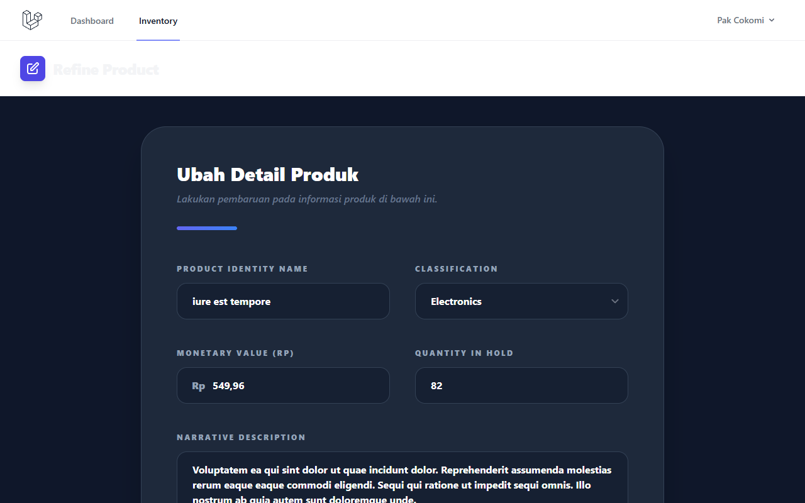

# Laporan Praktikum ABP - Pertemuan 5
## Sistem Informasi Inventaris Toko Pak Cokomi & Mas Wowo

Berikut adalah laporan hasil pengerjaan tugas Praktikum Aplikasi Berbasis Platform (ABP) Pertemuan 5. Pada tugas ini, saya telah membuat sistem inventaris toko menggunakan Framework Laravel, TailwindCSS untuk styling, dan Alpine.js.

Sesuai dengan instruksi tugas, kriteria yang sudah saya kerjakan meliputi:
- Pembuatan web inventaris untuk toko "Pak Cokomi" dan "Mas Wowo"
- Fitur CRUD lengkap untuk mengelola data produk
- Tampilan UI yang rapi mencakup Data Table, Form Create, Form Edit, dan Konfirmasi Delete dengan Modal
- Penggunaan Database Seeder dan Factory agar data awal produk tidak kosong
- Implementasi sistem login/autentikasi menggunakan Laravel Breeze

Di bawah ini adalah dokumentasi berupa screenshot ketika program dijalankan di server lokal:

### 1. Halaman Login
Halaman login dibuat menggunakan fitur autentikasi bawaan dari Laravel Breeze. Login bisa diakses menggunakan akun yang sudah saya buatkan di Seeder, yaitu `cokomi@toko.com` atau `wowo@toko.com`.

### 2. Dashboard
Halaman dashboard yang muncul pertama kali setelah berhasil login ke dalam sistem. Menampilkan judul toko sesuai penugasan.

### 3. Data Produk (Index & Data Table)
Halaman utama yang menampilkan daftar produk dalam bentuk tabel. Data yang ada di tabel ini otomatis digenerate dari Seeder dan Factory yang telah saya buat. Di sini juga terdapat tombol untuk Edit dan Hapus data.

### 4. Form Tambah Produk (Create)
Halaman form untuk memasukkan data produk baru. Form ini sudah dilengkapi dengan validasi input bawaan Laravel.

### 5. Form Edit Produk (Edit)
Halaman form yang berfungsi untuk mengubah data produk yang sudah tersimpan sebelumnya.

### 6. Modal Konfirmasi Hapus (Delete Modal)
Ketika tombol hapus ditekan, akan muncul pop-up modal peringatan konfirmasi sebelum data benar-benar dihapus. Modal ini dibuat agar tampilannya lebih rapi dan interaktif.

