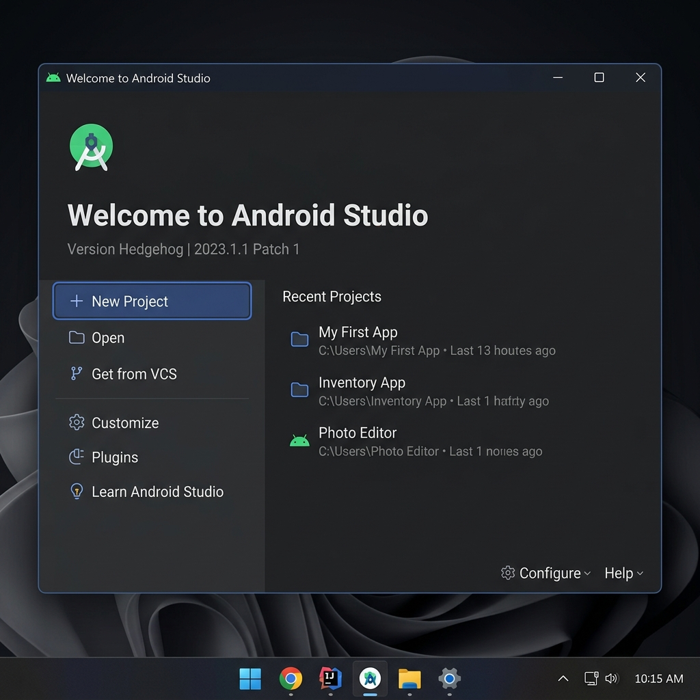
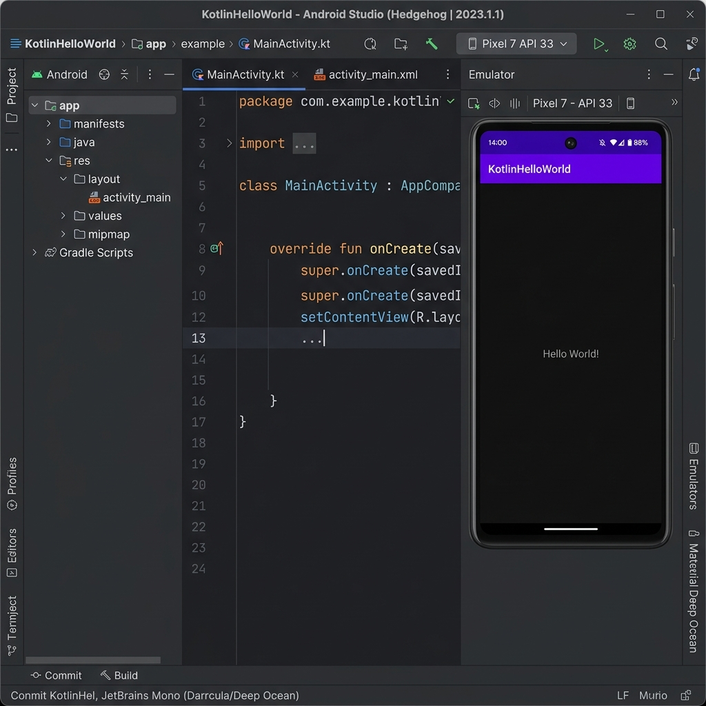

# 📱 Laporan Praktikum ABP - Pertemuan 6 (Bonus)
## Instalasi Android Studio & Demo Project Default

---

### 👤 Informasi Mahasiswa
*   **Nama:** Rizkulloh
*   **NIM:** 2311102142
*   **Mata Kuliah:** Praktikum Aplikasi Berbasis Platform (ABP)
*   **Topik:** Persiapan Environment Android Development

---

### 🛠️ 1. Bukti Instalasi Android Studio
Langkah awal dalam praktikum ini adalah melakukan instalasi **Android Studio** (Versi Terbaru). Berikut adalah bukti bahwa Android Studio telah berhasil terpasang dan siap digunakan pada sistem.

*Gambar 1: Tampilan Welcome Screen Android Studio sebagai bukti instalasi berhasil.*

---

### 🚀 2. Menjalankan Demo Project Default
Setelah instalasi selesai, dilakukan pembuatan project baru menggunakan template **"Empty Views Activity"**. Project ini dijalankan untuk memastikan SDK, Emulator, dan Build System (Gradle) berfungsi dengan baik.

**Detail Project:**
*   **Language:** Kotlin
*   **Build Configuration:** Kotlin DSL (gradle.kts)
*   **Min SDK:** API 24 (Android 7.0 Nougat)

*Gambar 2: Project 'My Application' berhasil dijalankan pada Emulator/Device dengan output 'Hello World!'.*

---

### 📝 Kesimpulan
Berdasarkan hasil di atas, environment untuk pengembangan aplikasi Android telah siap digunakan. Semua komponen utama seperti IDE, SDK Manager, dan Emulator telah terkonfigurasi dengan benar tanpa kendala teknis yang berarti.

---
*Dicetak pada: 2026-05-03 23:56*
