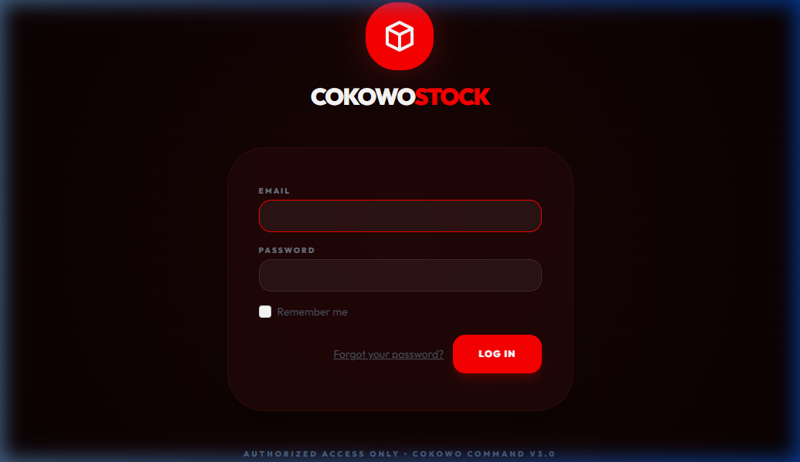
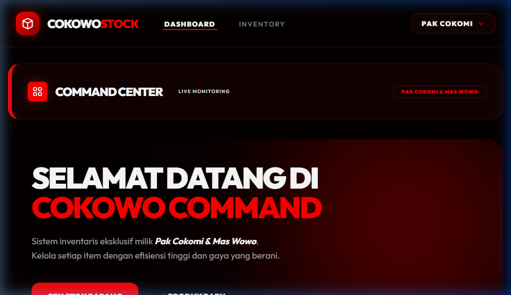
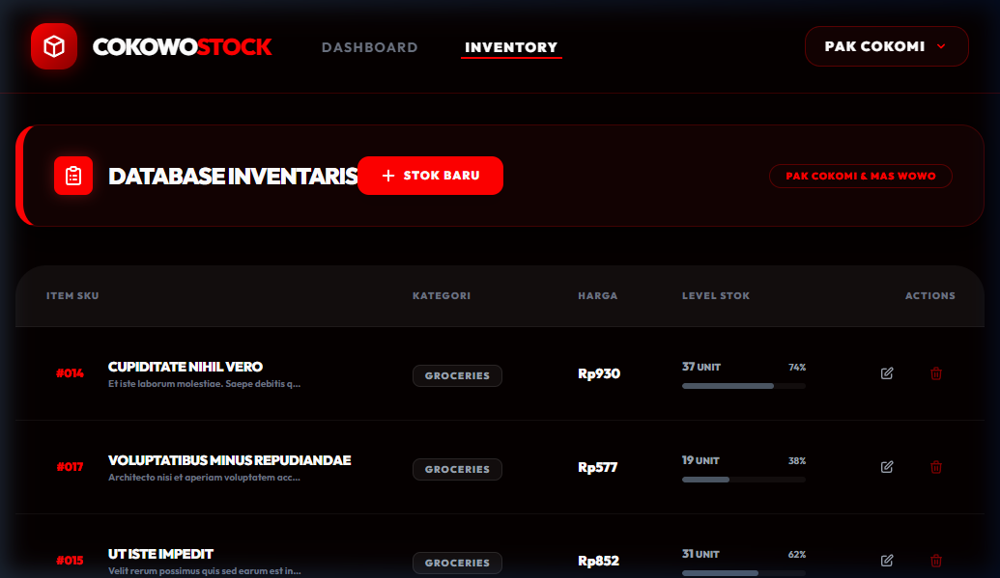
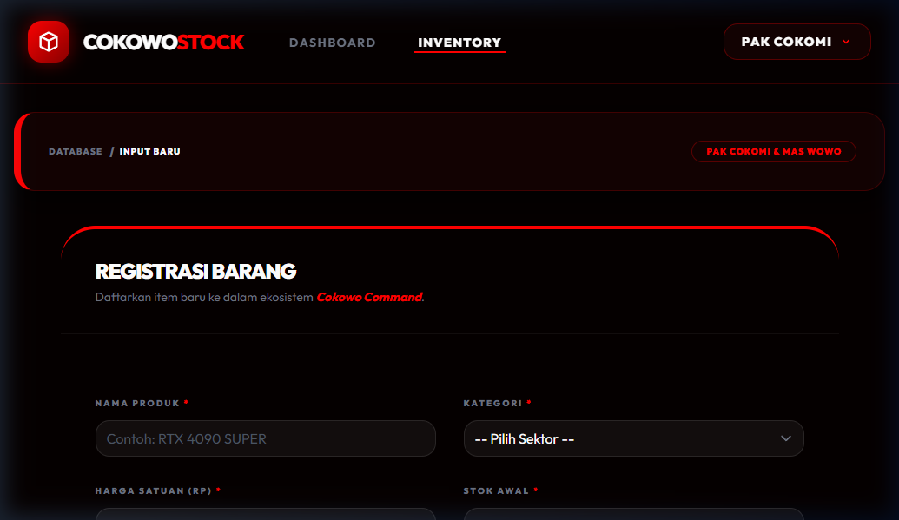
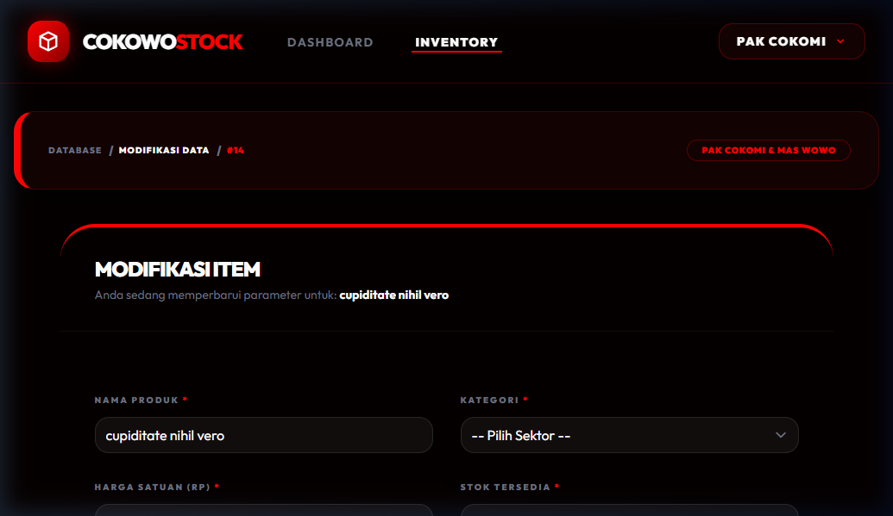
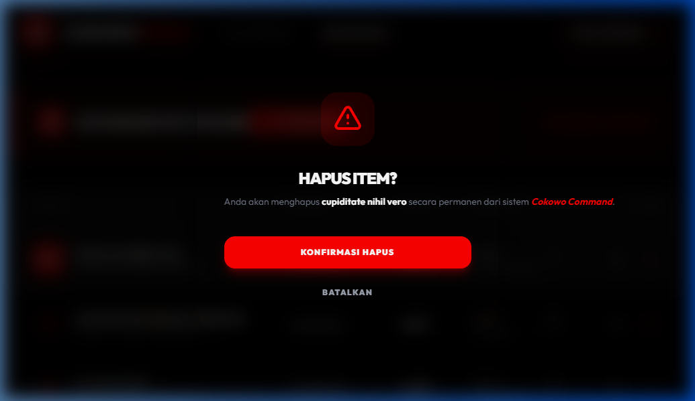

# Laporan Praktikum ABP - Pertemuan 5 (Premium Edition)
## Sistem Informasi Inventaris "Cokowo Command Center"

Berikut adalah laporan hasil pengerjaan tugas Praktikum Aplikasi Berbasis Platform (ABP) Pertemuan 5 yang telah dimodifikasi menjadi versi **Premium**. Pada tugas ini, saya telah mengimplementasikan sistem inventaris toko menggunakan Framework Laravel 13, TailwindCSS dengan custom branding, dan Alpine.js.

Sesuai dengan instruksi tugas, kriteria yang sudah saya kerjakan meliputi:
- Pembuatan web inventaris eksklusif untuk toko "Pak Cokomi" dan "Mas Wowo"
- Fitur CRUD lengkap dengan validasi data yang ketat
- Tampilan UI Premium (Dark Mode) dengan efek Glassmorphism dan Crimson Glow
- Penggunaan Database Seeder dan Factory untuk data awal
- Implementasi sistem login/autentikasi menggunakan Laravel Breeze

Di bawah ini adalah dokumentasi berupa screenshot asli dari sistem **Cokowo Command** yang dijalankan di server lokal:

### 1. Halaman Login
Halaman login menggunakan desain yang bersih dengan skema warna gelap. Login dapat diakses menggunakan akun: `cokomi@toko.com` atau `wowo@toko.com`.

### 2. Dashboard (Command Center)
Halaman utama setelah login menampilkan ringkasan aset secara real-time dengan desain "Command Center" yang futuristik.

### 3. Database Inventaris (Index)
Menampilkan daftar seluruh produk dalam bentuk tabel premium. Terdapat indikator stok yang akan berubah warna dan berkedip (pulse) jika stok menipis (di bawah 10 unit).

### 4. Registrasi Barang (Create)
Form input barang baru dengan desain modern. Setiap field dilengkapi dengan validasi dan placeholder yang jelas.

### 5. Modifikasi Data (Edit)
Halaman untuk mengubah parameter produk yang sudah ada di database tanpa harus menghapus data lama.

### 6. Konfirmasi Penghapusan (Delete Modal)
Implementasi Modal interaktif menggunakan Alpine.js untuk memastikan pengguna tidak sengaja menghapus data penting.

---
**Catatan Teknis:**
Aplikasi ini berjalan di atas Laravel 13 dengan PHP 8.3.
